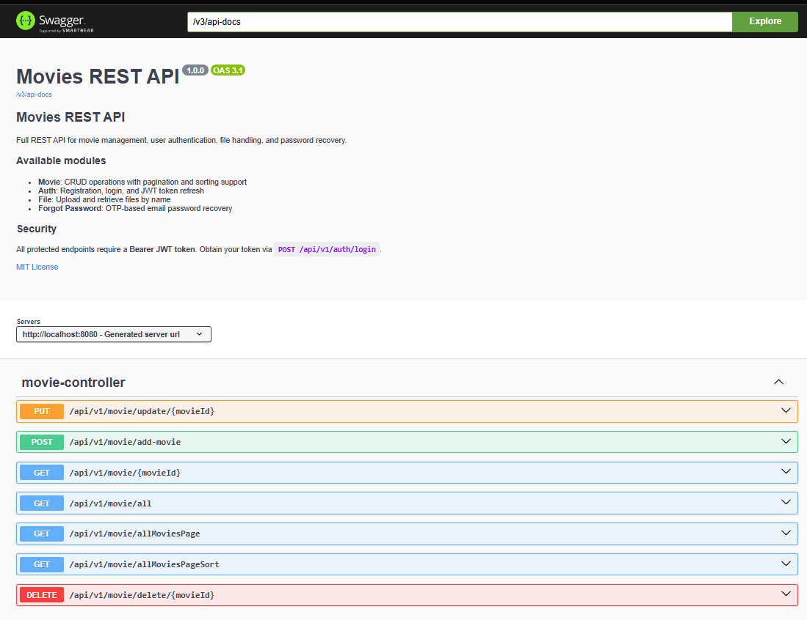
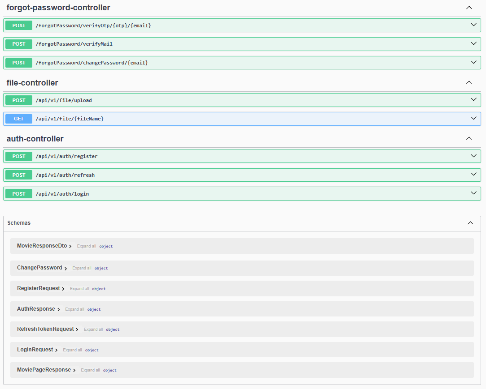

# 🎬 Movie API

A RESTful API built with **Spring Boot 3.5** for managing a movie catalog, featuring JWT-based authentication, refresh
tokens, forgot-password flow with OTP, file upload for posters, and full pagination/sorting support.

---

## 📸 Screenshots




---

## 🛠️ Tech Stack

| Layer        | Technology                          |
|--------------|-------------------------------------|
| Language     | Java 21                             |
| Framework    | Spring Boot 3.5.11                  |
| Security     | Spring Security + JWT (jjwt 0.12.7) |
| Persistence  | Spring Data JPA + Hibernate         |
| Database     | MySQL 8                             |
| Validation   | Jakarta Bean Validation             |
| Email        | Spring Mail (JavaMailSender)        |
| File Storage | Local filesystem                    |
| API Docs     | SpringDoc OpenAPI (Swagger UI)      |
| Build Tool   | Maven                               |
| Utilities    | Lombok                              |

---

## 📁 Project Structure

```
src/
└── main/
    └── java/com/rvg/movieapi/
        ├── auth/
        │   ├── config/          # ApplicationConfig, SecurityConfiguration
        │   ├── entities/        # User, RefreshToken, ForgotPassword, UserRole
        │   ├── repositories/    # UserRepository, RefreshTokenRepository, ForgotPasswordRepository
        │   ├── services/        # AuthService, AuthFilterService, JwtService, RefreshTokenService
        │   └── utils/           # AuthResponse, LoginRequest, RegisterRequest, ChangePassword
        ├── controllers/         # AuthController, FileController, ForgotPasswordController, MovieController
        ├── dto/                 # MovieRequestDto, MovieResponseDto, MoviePageResponse, MailBody
        ├── entities/            # Movie
        ├── exceptions/          # GlobalExceptionHandler, MovieNotFoundException, FileExistsException, EmptyFileException
        ├── repository/          # MovieRepository
        ├── service/             # MovieService, MovieServiceImpl, FileService, FileServiceImpl, EmailService
        └── utils/               # AppConstants
```

---

## 🔐 Authentication Flow

The API uses stateless JWT authentication:

1. **Register** — creates a new user, returns an access token + refresh token
2. **Login** — validates credentials, returns a new token pair
3. **Refresh** — exchanges a valid refresh token for a new access token
4. **All protected routes** require a `Bearer` token in the `Authorization` header

```
POST /api/v1/auth/register
POST /api/v1/auth/login
POST /api/v1/auth/refresh
```

---

## 🔑 Forgot Password Flow

```
POST /forgotPassword/verifyMail?email=   →  Sends a 6-digit OTP (valid 70s)
POST /forgotPassword/verifyOtp/{otp}/{email}  →  Validates the OTP
POST /forgotPassword/changePassword/{email}   →  Updates the password
```

---

## 🎥 Movie Endpoints

All movie endpoints require authentication. Adding movies requires `ADMIN` authority.

| Method   | Endpoint                          | Description             | Auth    |
|----------|-----------------------------------|-------------------------|---------|
| `POST`   | `/api/v1/movie/add-movie`         | Add movie with poster   | `ADMIN` |
| `GET`    | `/api/v1/movie/{movieId}`         | Get movie by ID         | Any     |
| `GET`    | `/api/v1/movie/all`               | Get all movies          | Any     |
| `PUT`    | `/api/v1/movie/update/{movieId}`  | Update movie            | Any     |
| `DELETE` | `/api/v1/movie/delete/{movieId}`  | Delete movie            | Any     |
| `GET`    | `/api/v1/movie/allMoviesPage`     | Paginated list          | Any     |
| `GET`    | `/api/v1/movie/allMoviesPageSort` | Paginated + sorted list | Any     |

### Add/Update Movie — Multipart Request

```
POST /api/v1/movie/add-movie
Content-Type: multipart/form-data

file   → poster image file
movie  → JSON string: { "title", "director", "studio", "movieCast", "releaseYear" }
```

---

## 📂 File Endpoints

```
POST /api/v1/file/upload           →  Upload a file
GET  /api/v1/file/{fileName}       →  Serve a file by name
```

---

## ⚙️ Configuration

Set the following properties in `application.properties`:

```properties
# Database
spring.datasource.url=jdbc:mysql://localhost:3306/moviedb
spring.datasource.username=your_user
spring.datasource.password=your_password
# JWT
app.security.jwt-secret=your_base64_encoded_secret
app.security.jwt-expiration-ms=3600000
# File storage
project.poster=./posters
base.url=http://localhost:8080
# Email (SMTP)
spring.mail.host=smtp.gmail.com
spring.mail.port=587
spring.mail.username=your_email@gmail.com
spring.mail.password=your_app_password
spring.mail.properties.mail.smtp.auth=true
spring.mail.properties.mail.smtp.starttls.enable=true
```

---

## 📖 API Documentation

Swagger UI is available at:

```
http://localhost:8080/swagger-ui/index.html
```

OpenAPI JSON spec:

```
http://localhost:8080/v3/api-docs
```

---

## 🧪 Running Tests

```bash
mvn test
```

Tests are written with **JUnit 5** and **Mockito**. Coverage includes:

- `ApplicationConfig` — UserDetailsService, AuthenticationProvider, PasswordEncoder
- `AuthFilterService` — JWT filter chain behavior
- `AuthService` — register and login flows
- `JwtService` — token generation, validation, expiration
- `RefreshTokenService` — token creation and verification
- `AuthController`, `FileController`, `ForgotPasswordController`, `MovieController`
- `MovieServiceImpl` — business logic and file operations
- `FileServiceImpl` — file system operations with temp directories
- `EmailService` — mail message construction and dispatch
- `GlobalExceptionHandler` — error mapping per exception type
- `User` entity — Spring Security `UserDetails` contract

---

## 🚀 Running Locally

### Prerequisites

- Java 21
- Maven 3.8+
- MySQL 8

### Steps

```bash
# Clone the repository
git clone https://github.com/rvega1204/movieAPI-Java-MySQL.git
cd movieapi

# Configure application.properties

# Run
mvn spring-boot:run
```

---

## 📝 License

This project is for educational purposes. Ricardo Vega 2026
